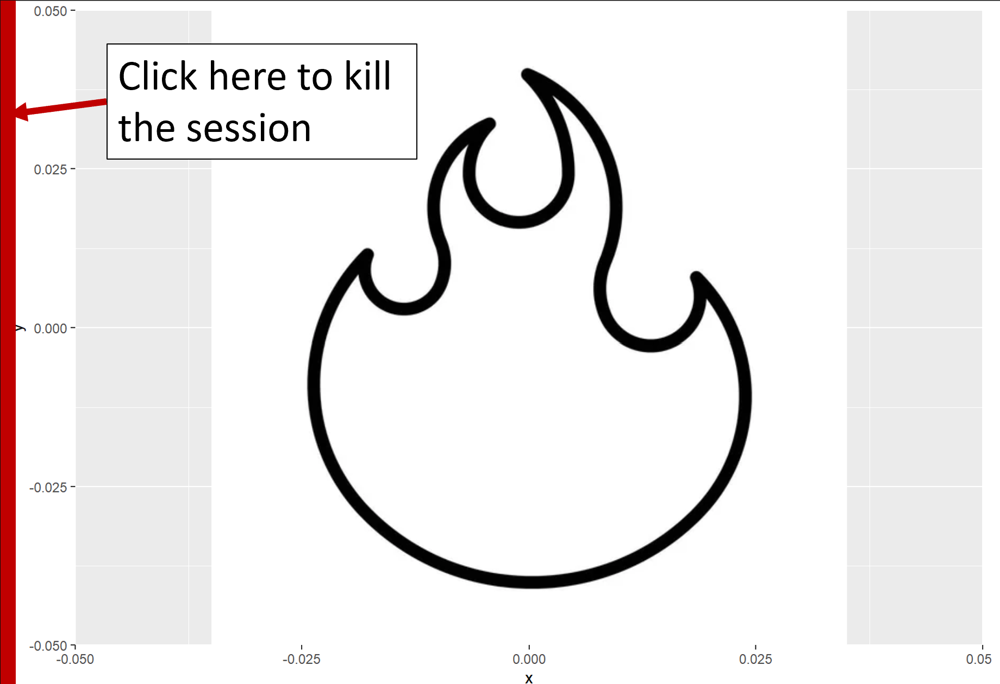
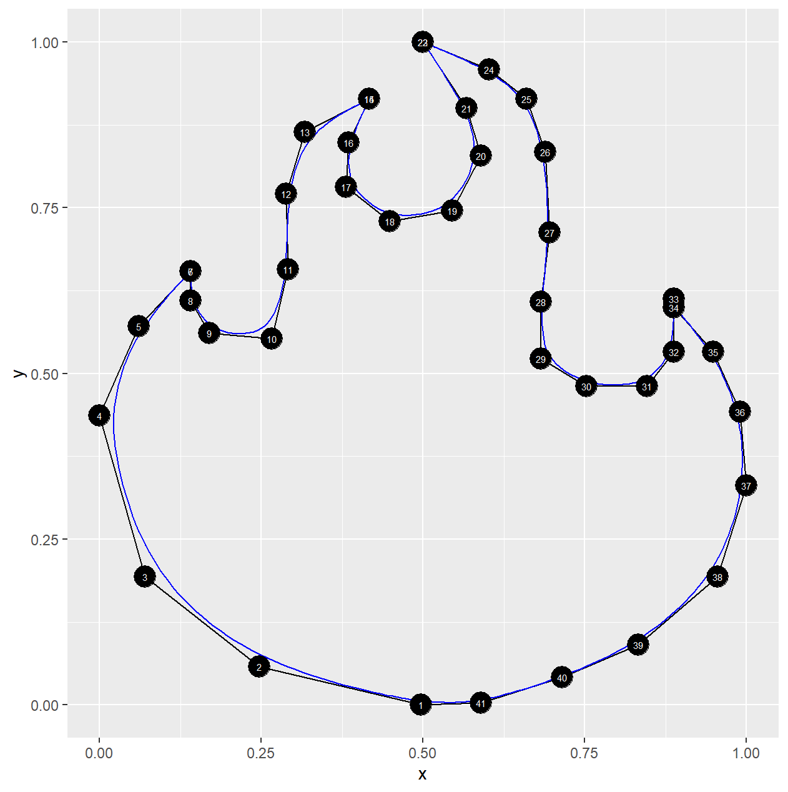
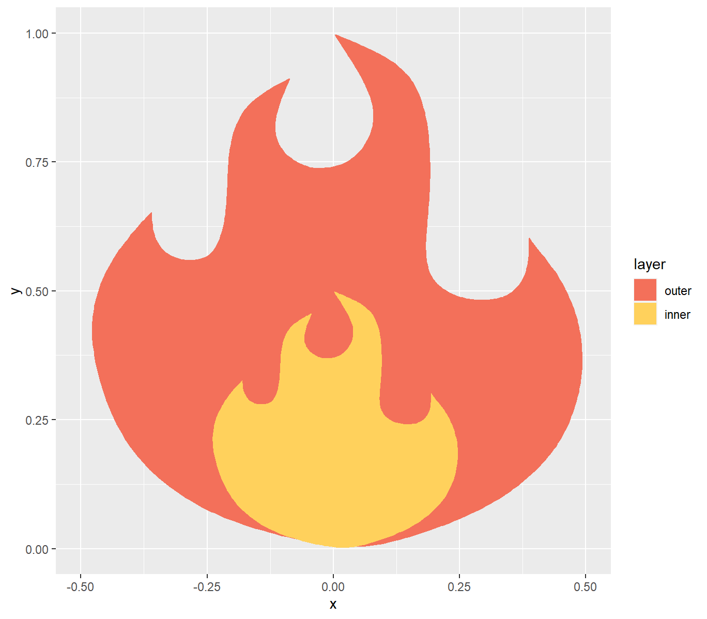
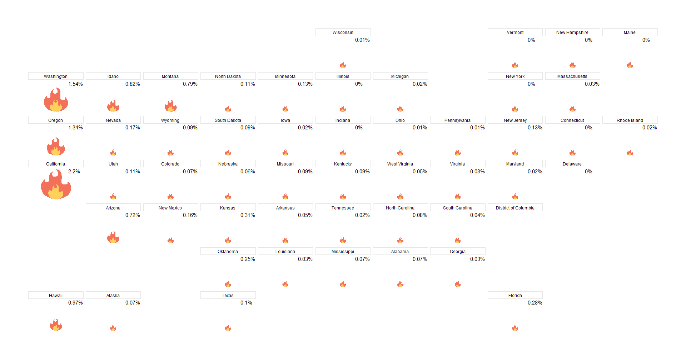

# traceR 

`traceR` allows you to click on an image in the plot window (kind of
like a join the dots picture) and record the coordinates into a data
frame. They can then be plotted independently in a ggplot.

This enables the user to plot custom shapes in R without having to
manually enter the coordinates into a data frame.

## Installation

Install from Github:

``` r
devtools::install_github("doehm/traceR")
```

## Usage

### TL;DR

To use `trace_image`:

1.  Plot an image in `ggplot`
2.  Run `df <- trace_image()`
3.  Click on the desired coordinates in the required sequence
4.  When finished click on the left side of the plot window between 0
    and `stop_window` pixels on the x-axis
5.  Inspect the coordinates with `inspect_trace`

The coordinates are scaled to (0, 1) by default and returned as a
`tibble`. There is an option to return the raw pixel coordinates by
setting `scale = FALSE`. You will want to do this if you are selecting
multiple layers or objects.

## Example

To demonstrate with a more detailed example, suppose you really liked
the design of this flame and wanted to use it for some data viz.

<center>

</center>

Firstly, plot the flame with `ggplot2`.

``` r
library(tidyverse)
library(ggpath)

flame_path <- "https://github.com/doehm/traceR/blob/main/dev/images/simple-flame.jpg?raw=true"
ggplot() +
  geom_from_path(aes(0, 0, path = flame_path))
```

Then run

``` r
df_flame <- trace_iamge(scale = TRUE)
```

Some info will pop up in the console and you are ready to record the
coordinates. Start anywhere on the outline of the image and click and
suitable intervals. For tighter curves you’ll want to shorter intervals
to better recreate the curve.

Click twice for sharp points like at the peak of the flames.
`ggforce::geom_bspline_closed0()` is great at interpolating the points
and drawing a curve and we can trick it into drawing a sharp point by
clicking in the same place twice.

Click on the left side of the plotting window when you are done
recording the coordinates (within 0-20 pixels by default). This will
kill the recording and return the data frame.

<center>

</center>

Inspect the coordinates with `inspect_trace()`. This plots the
coordinates using `geom_polygon()` and `geom_bspline_closed0` so you can
see if you got what you need.

``` r
inspect_trace(df_flame)
```

<center>

</center>

Now that you have what you need as a data frame you can plot it using
standard `ggplot2` geoms. For example

``` r
pal <- c(outer = '#f3705a', inner = '#ffd15c')

df_flame1 <- df_flame |> 
  mutate( # create the outer layer
    x = x-0.5, # center the coords around 0
    layer = "outer"
    ) |> 
  bind_rows( # create and append the inner layer
    df_flame |> 
    mutate(
      x = (x-0.5)*0.5, # center and scale the coords by 50%
      y = y*0.5,       # scale the coords by 50%
      layer = "inner"
    )
  ) |> 
  mutate(layer = factor(layer, levels = c("outer", "inner")))

df_flame1 |> 
  ggplot(aes(x, y, fill = layer)) +
  geom_bspline_closed0() +
  scale_fill_manual(values = pal)
```

<center>

</center>

At this point you can get creative and do what you want with it. For
example you could use the flame to create an infographic of bushfire
damage in the US.

``` r
library(geofacet)

# scale the coords for each state based on the total area burned
df_bushfires <- read_rds("https://github.com/doehm/traceR/blob/main/dev/data/bushfires.rds?raw=true")

df_base <- map_dfr(df_bushfires$code, ~{
  dat <- df_bushfires |>
    filter(code == .x)
  df_flame1 |>
    mutate(
      x = x*dat$cat_burned,
      y = y*dat$cat_burned,
      code = dat$code,
      state = dat$state
    )
})

df_base |>
  ggplot() +
  geom_bspline_closed0(aes(x, y, fill = layer), colour = NA) +
  facet_geo(~state, grid = "us_state_grid1") +
  scale_fill_manual(values = pal) +
  xlim(-4, 4) +
  theme_void() +
  theme(
    plot.margin = margin(t=60, b=60, l=60, r=60)
    legend.position = "none",
    strip.background = element_rect(colour = "grey90"),
    strip.text = element_text(margin = margin(t = 3, b = 3))
  )
```

<center>

</center>

It’s not perfect but it is a very convenient way to get the coords into
a data frame for you to start working with.

This flame is simple enough that you wouldn’t need to trace it to use it
in this way. But if you have a more complex image with a bunch of stuff
going on it comes in handy.

Once you start getting creative you can layer up traces and create
images like this cute little dino that I’ve adopted for the hex!

<center>

</center>
